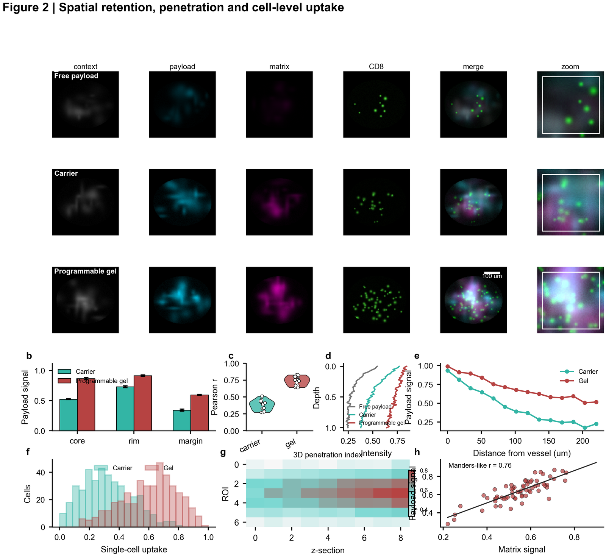
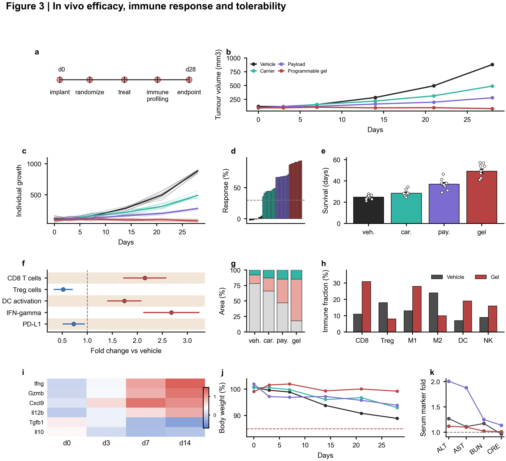
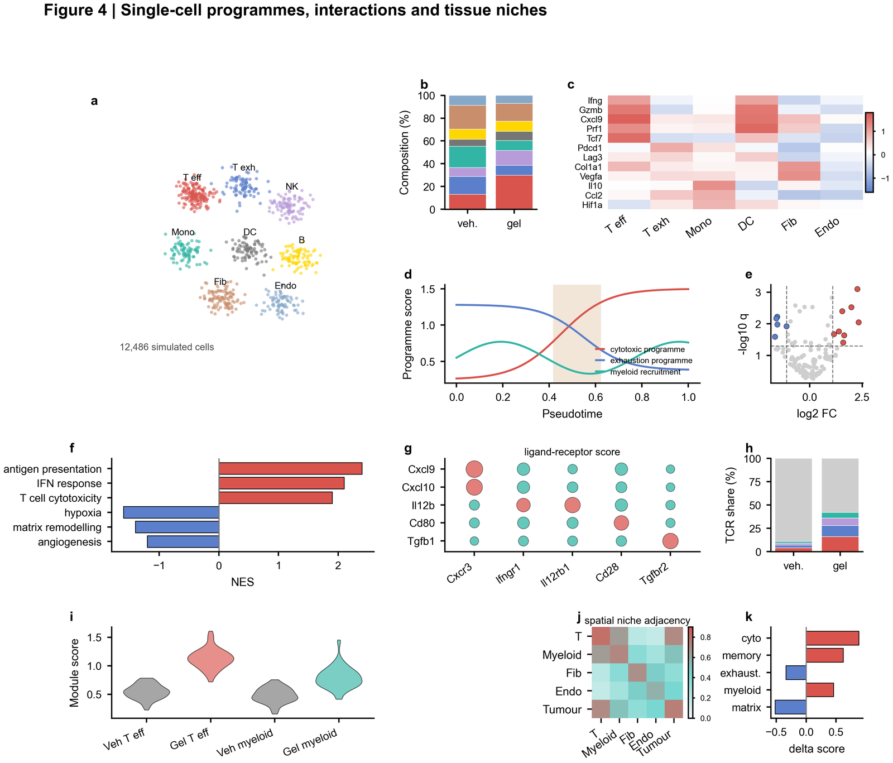

# nature-skills 
| Overview | Community |
| :--- | :---: |
| **Welcome! Let's co-create nature-skills.**<br><br>A growing collection of Claude skills for producing academic work at *Nature*-journal standard.<br><br>Currently covering scientific figures, manuscript prose, data availability, and paper-to-presentation workflows; future releases may add related tasks such as statistical reporting, peer‑review responses, and methods writing.<br><br>**Our philosophy** — Every skill in this collection shares a common philosophy: rules are derived from **primary sources** (published *Nature* papers, journal author guidelines, and structured writing curricula), not from general style intuition. | <br><br>*The group is currently full. Please contact the administrator if you’d like to join.* |

---

## Star History

[](https://star-history.com/#Yuan1z0825/nature-skills&Date)

---

## Skill index

| Skill | Status | Purpose | Trigger keywords |
|-------|--------|---------|-----------------|
| [`nature-figure`](nature-figure/README.md) | Stable | Publication-ready matplotlib figures | "Nature figure", "publication plot", "scientific figure" |
| [`nature-polishing`](nature-polishing/README.md) | Stable | Academic prose polishing to *Nature* style | "Nature style", "polish", "academic writing" |
| [`nature-data`](nature-data/README.md) | Draft | Nature Data Availability statements, repository plans, and FAIR checks | "Data Availability", "repository", "FAIR metadata", "数据可用性声明" |
| [`nature-paper2ppt`](nature-paper2ppt/README.md) | Beta | Chinese PPTX decks from scientific papers | "paper PPT", "journal club", "文献汇报", "论文做成PPT" |

> **Adding a new skill?** Follow the [contribution guide](#adding-a-new-skill) at the bottom of this file.

---

## nature-figure

**What it does** — Generates multi-panel matplotlib figures that match *Nature* journal
visual standards: correct typography, semantic colour palette, editable SVG output,
and non-redundant panel information architecture.

**Example output gallery** — Five dense, simulated *Nature*-style result figures are
included in the [`nature-figure` gallery](nature-figure/README.md#example-output-gallery):
material/mechanism, spatial imaging, in vivo efficacy, single-cell systems and
perturbation validation.

**Chart-type atlas** — The [`nature-figure` chart atlas](nature-figure/README.md#chart-type-atlas)
classifies 10 supported chart families, including bar, line, heatmap, scatter/bubble,
radar/polar, distribution, forest/interval, area/stacked, image-plate and network/matrix
layouts.

<p>
  <a href="nature-figure/assets/gallery/fig1-material-mechanism-rich.png">
    
  </a>
  <a href="nature-figure/assets/gallery/fig2-spatial-imaging-rich.png">
    
  </a>
  <a href="nature-figure/assets/gallery/fig3-in-vivo-efficacy-rich.png">
    
  </a>
  <a href="nature-figure/assets/gallery/fig4-single-cell-systems-rich.png">
    
  </a>
  <a href="nature-figure/assets/gallery/fig5-validation-perturbation-rich.png">
    
  </a>
</p>

**Built from** — Production scripts from papers published in *Nature Machine Intelligence*
and top ML/bioinformatics venues ([figures4papers](https://github.com/ChenLiu-1996/figures4papers)).

**Key rules enforced**

- Three mandatory rcParams must always appear first:
  ```python
  plt.rcParams['font.family'] = 'sans-serif'
  plt.rcParams['font.sans-serif'] = ['Arial', 'DejaVu Sans', 'Liberation Sans']
  plt.rcParams['svg.fonttype'] = 'none'   # text stays as <text> nodes, not paths
  ```
- Primary output is always `.svg`; `.png` at 300 dpi is a secondary raster preview.
- Multi-panel figures follow a three-level information hierarchy: **overview → deviation → relationship**. No two panels may answer the same scientific question.

**Reference files**

```
nature-figure/
├── README.md
├── SKILL.md
└── references/
    ├── api.md            PALETTE, helper signatures, validation rules
    ├── design-theory.md  Typography, layout, export policy, anti-redundancy rules
    ├── common-patterns.md Ultra-wide panels, legend axes, print-safe bars
    ├── tutorials.md      End-to-end walkthroughs (bars, trends, heatmaps)
    └── chart-types.md    Radar, 3D sphere, scatter, fill_between, log-scale
```

**Supported chart types** — Stacked bar, grouped bar, horizontal ablation bar, trend/line,
sequential heatmap, diverging z-score heatmap, bubble scatter, radar/polar, 3D sphere
illustration, fill-between area, log-scale bar, GridSpec multi-panel.

---

## nature-polishing

**What it does** — Transforms academic draft text (including Chinese → English translation)
into prose matching *Nature* journal conventions: ≤ 30-word sentences, section-aware
tense and hedging, precise vocabulary, correct citation practice, and British English.

**Built from** — Close reading of five *Nature* s41586 papers (2026) and a graduate-level
scientific English writing course; 25 rules extracted across sentence architecture,
paper structure, vocabulary, citation integrity, house style, and AI ethics.

**Key rules enforced**

| Domain | Core rule |
|--------|-----------|
| Sentence length | Every sentence ≤ 30 words; count individually; last sentence most likely to fail |
| Hedging calibration | Match claim strength to evidence: *demonstrate* → *suggest* → *may reflect* |
| Section tense | Results = past tense + quantitative detail; Discussion = hedging + mechanism |
| Citation integrity | Cite only sources personally read and verified; four attribution types |
| Overclaim detection | Flag absolutes, unwarranted causation, scope expansion, unverified "first" claims |
| British English | signalling, colour, analyse, programme, modelling, behaviour |

**12-step polishing workflow**

Sentence split → Section ID → Hourglass check → Tense audit → Sentence edit →
Vocabulary upgrade → Template check → Citation audit → House style → Overclaim →
Proofreading → Plain-text output

**Reference files**

```
nature-polishing/
├── README.md
└── SKILL.md    25 rules + 12-step workflow (loaded by Claude automatically)
```

---

## nature-data

**What it does** — Prepares and audits Data Availability statements, repository plans,
dataset citations, and FAIR metadata checks for Nature-family and Springer Nature
submissions. It is bilingual-aware: Chinese author notes such as "数据可用性声明",
"可向通讯作者索取", "原始数据", "受限数据", and "公开数据库" are converted into precise
submission-ready English with Chinese action notes.

**Built from** — Springer Nature research data policy, Nature Portfolio reporting standards,
Scientific Data repository and citation practice, the FAIR Guiding Principles, and DataCite
metadata conventions.

**Key rules enforced**

| Domain | Core rule |
|--------|-----------|
| Data Availability | Map every result-supporting dataset to a durable access route |
| Repository strategy | Prefer mandated or discipline-specific repositories with persistent identifiers |
| Restricted data | State the restriction reason, controller, review route, and access conditions |
| Dataset citations | Cite public datasets with DataCite-style creator, title, repository, year, and identifier metadata |
| FAIR metadata | Check identifiers, licence, README/data dictionary, provenance, version, and reuse conditions |
| Chinese alignment | Translate intent rather than literal wording; flag vague "reasonable request" phrasing |

**Reference files**

```
nature-data/
├── README.md
├── SKILL.md
├── agents/
│   └── openai.yaml
└── references/
    ├── chinese-author-alignment.md
    ├── fair-metadata-checklist.md
    ├── policy-principles.md
    ├── repository-and-identifiers.md
    ├── source-basis.md
    └── statement-patterns.md
```

---

## nature-paper2ppt

**What it does** — Turns a scientific paper, preprint, PDF, article text, abstract,
figure legends, or reading notes into a concise Chinese `.pptx` presentation for journal
club, group meeting, lab meeting, paper sharing, or thesis seminar.

The skill identifies the paper type and central argument, selects only figures and tables
that support the evidence chain, writes Chinese slide titles, bullets, captions, takeaways
and speaker notes, creates the actual PPTX deck, and runs lightweight package QA.

**Key rules enforced**

| Domain | Core rule |
|--------|-----------|
| Narrative | Use the paper's scientific argument as the slide spine, not the manuscript section order |
| Paper type | Classify the paper before choosing claim-first, problem-to-solution, workflow-to-validation, or evidence-map logic |
| Figures | Use figures as evidence; crop or split dense panels rather than shrinking them into unreadable slots |
| Output | Build a real `.pptx` as the primary deliverable, with Chinese text and speaker notes |
| QA | Reopen or inspect the PPTX package, record slide count, embedded media, notes, and any rendering limits |
| Integrity | Do not fabricate results, methods, numbers, datasets, mechanisms, or figure details |

**Reference files**

```
nature-paper2ppt/
├── README.md
└── SKILL.md
```

---

## Shared design principles

All skills in this collection adhere to the following:

1. **Primary sources only** — rules are grounded in published *Nature* content or official
   journal guidelines, not general style preference.
2. **Explicit over implicit** — every rule is stated with a rationale, not just asserted.
3. **Section-aware** — academic writing and figures both require context-sensitivity;
   each skill applies different logic depending on which part of a paper is being handled.
4. **Output-first** — every skill returns something immediately usable: copy-paste prose,
   a `.svg` file, a `.pptx` deck, or a concrete recommendation. No intermediate planning documents.
5. **Extensible by design** — each skill is self-contained in its own directory; adding a
   new skill requires no changes to existing ones.

---

## Adding a new skill

To add a skill to this collection:

**1. Create a directory**
```
nature-<topic>/
```

**2. Minimum required files**

| File | Required | Purpose |
|------|----------|---------|
| `SKILL.md` | Yes | Frontmatter (`name`, `description`) + rules + workflow; loaded by the agent after triggering |
| `README.md` | Yes | Human-readable reference in full English |
| `references/*.md` | Recommended for complex skills | Modular rule files (api, design theory, tutorials, chart types, …) |

**3. SKILL.md frontmatter template**
```yaml
---
name: nature-<topic>
description: >-
  One-sentence description of what the skill does and when to trigger it.
  Include the output format and the primary use case.
---
```

**4. Update this index**

Add a row to the [Skill index](#skill-index) table above:
```markdown
| [`nature-<topic>`](nature-<topic>/README.md) | Draft / Stable | One-line purpose | trigger keywords |
```

**5. Status labels**

| Label | Meaning |
|-------|---------|
| `Draft` | Rules defined; not yet tested on real examples |
| `Beta` | Tested on examples; edge cases may remain |
| `Stable` | Validated on real academic content; rules are settled |

---

## Candidate skills (not yet built)

The following are documented gaps. Contributions welcome.

| Candidate | Scope | Priority |
|-----------|-------|----------|
| `nature-stats` | Statistical reporting conventions for *Nature* (effect sizes, confidence intervals, p-value formatting, sample size statements) | High |
| `nature-response` | Peer-review response letters — point-by-point reply structure, tone calibration, handling major vs. minor revisions | High |
| `nature-methods` | Deep-dive Methods writing assistant — reproducibility checklist, forbidden phrases, ethical approval templates, supplementary organisation | Medium |
| `nature-cover` | Cover letter drafting — hook paragraph, significance framing, fit-to-journal argument, ≤ 500-word limit | Medium |
| `nature-review` | Writing a literature review or review article in *Nature Reviews* style — synthesis vs. summary, argument-led structure | Low |
